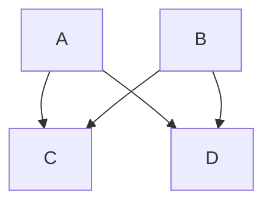
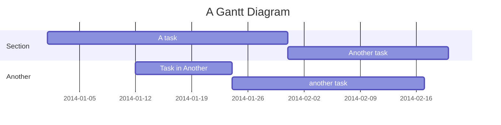
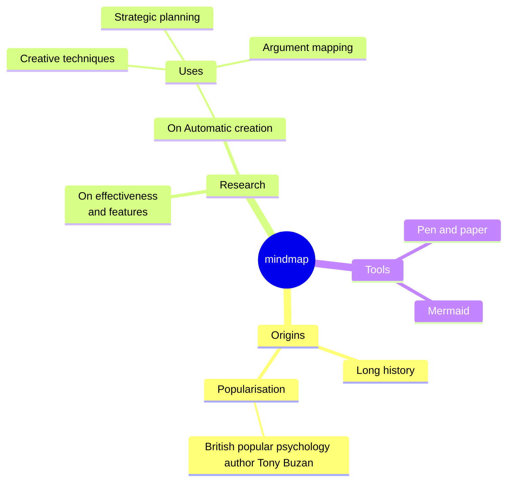

**Gitlab可透過與kroki server的整合，支援在markdown檔案內容裏嵌入mermaid語法以顯示圖片。**

目前雖然不是支援所有的mermaid視覺化效果，但常用的diagram大部份都有支援(如流程圖、甘特圖、心智圖)。

詳細可參考mermaid的語法說明：https://mermaid.js.org/intro/syntax-reference.html

---

## 流程圖

---

## 甘特圖

---

## 心智圖

---