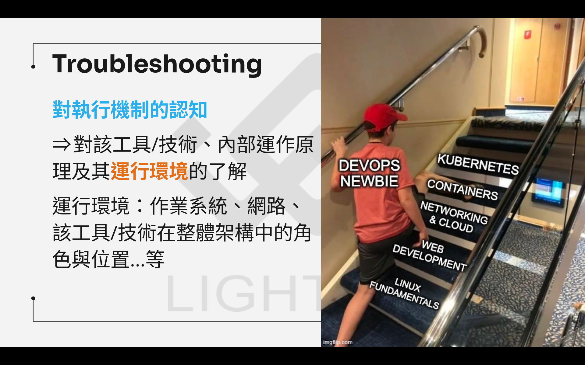

[[_TOC_]]

---

# Workshop說明
## 1. Troubleshooting環境
現在有一台Ubuntu 22.04主機，裡面有用systemd管理NGINX web server，但該web server現在無法正常運作，請修復它。
 1. 請用ldap帳號登入192.168.23.123:2201
 2. 登入後請執行`tmux`(可重新連接的terminal) or `tmux attach -t X`(X是先前已建立的session id)，方便主講者後續連線一起解決問題
 3. 接著執行`ssh aws-troubleshooting-vm`連線進入今天要做troubleshooting的主機環境
 4. 執行`curl localhost`，看到什麼訊息?

### systemd?
系統與服務管理工具
 - 系統啟動流程
 - 服務管理
 - Process監控
 - 日誌管理
 
 
 
 
 
 
 
 
 
 
 
 
 
 
 

## 2. 在動手之前
 - 不要瞎猜，試著培養排查邏輯思維方向，工具只是輔助
 - 環境中的問題都是基本常見的錯誤，請盡可能嘗試排除
 - 不知道下一步可以做什麼是正常的，問題排查就是這樣
 - 有些專業知識是透過調查系統為何無法運作才能獲得的
