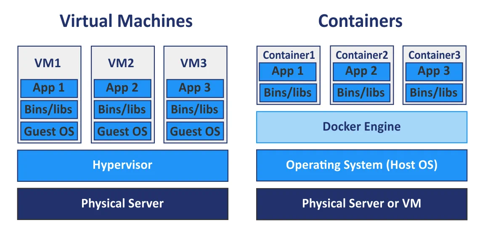
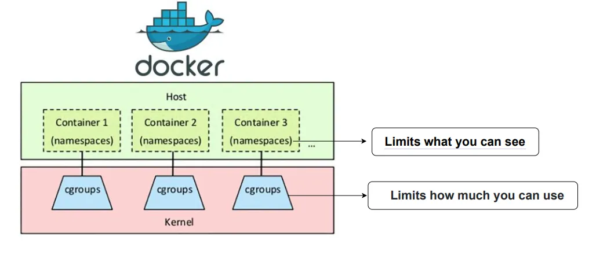

<br/><br/><br/>

# Virtual machine vs Container


<br/><br/>

# namespace / cgroup for container


## namespaces
 - <span style="color: red">Mount</span>: Mount points (filesystems)
 - Network: Network interfaces, routing tables, etc.
 - UTS: Hostname
 - PID: Process IDs
 - IPC: Interprocess Communication (semaphore, queue)
 - User: User and group IDs
 - Time: System clocks

## cgroups
 - cpu: CPU time allocation
 - cpuset: CPU core binding
 - memory: RAM and swap usage
 - blkio:	Block I/O (disk) bandwidth
 - pids: Number of processes

# Bonus
 - 取得docker容器的主行程id
    ```shell
    docker inspect -f '{{.State.Pid}}' <container_name_or_id>
    ```
 - 檢查容器是否跟host相同namespace
    ```shell
    # under host shell, use stat to see the inode number of namespace, e.g.: mnt
    stat -c %i /proc/<pid>/ns/mnt

    # under host shell, check the inode number of host mnt namespace
    stat -c %i /proc/$$/ns/mnt
    ```
 - 在與容器主行程相同的namespace內執行指令
    ```shell
    # see a container's port information using host's command
    nsenter --net -t <pid> ss -tulpn

    # switch to a container's environment fully without docker
    nsenter -a -t <pid>
    ```
 - 建立namespace並在其中執行指令
    ```shell
    # you will see only 2 processes: bash & ps
    unshare --pid --mount --fork bash
    mount -t proc proc /proc
    ps -ef
    ```

<br/><br/><br/>
<div style="display: flex; justify-content: space-between;">
  <a href="01_我可能不會跟你在一起.md">我可能不會跟你在一起</a>　　　　　　　　　　　　　　　　　　　　　　　　　　　　　　　　　　　　　　　
  <a href="03_這不是我寫的Dockerfile，但它的錯是我來debug的.md">這不是我寫的Dockerfile，但它的錯是我來debug的</a>
</div>