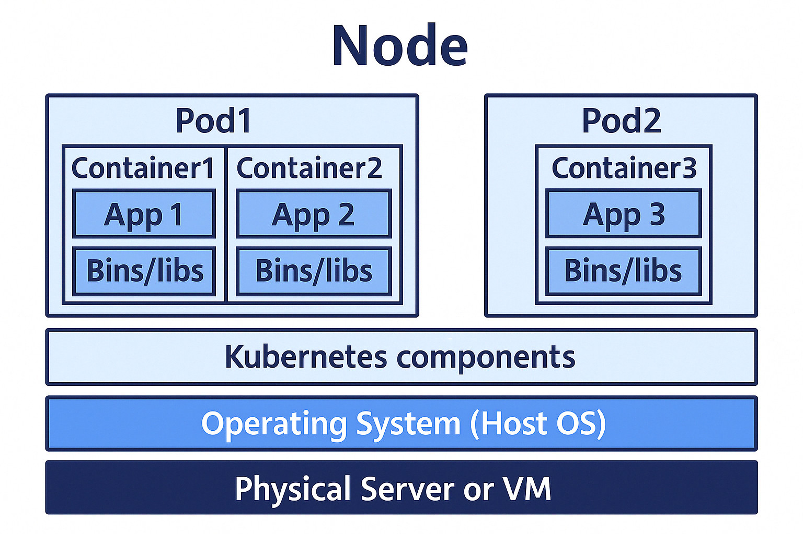

   

# Google Cloud Platform (GCP)
 - Google雲端服務平台
 - 常見服務
   - Compute Engine：VM
   - Cloud Storage：物件(檔案)儲存
   - Artifact Registry：容器映像檔儲存
   - Secret Manager：secret儲存
   - Kubernetes Engine (GKE)：整合了GCP部份服務的**Kubernetes**

# Pod

 - Pod是kubernetes內最小的部署單位
 - Pod可包含1個以上的容器；容器間共享Network namespace，擁有相同的ip(pod ip)

# Kubernetes (K8S)
 - 可擴充的開源平台，用來自動化容器的部署、擴展與管理。
 - 重要組成
   1. 節點元件
      - container runtime：負責實際運行容器的執行環境
      - kubelet：Node agent，負責與kube-apiserver通訊，確保節點上的容器與 Pod運行狀態符合期望
      - reverse proxy(eBPF-based or ~~iptables-based~~)：管理Pod網路連線，負責實作Service的轉送邏輯
   2. 控制平台(control plane)
      - kube-apiserver：K8S通訊中樞，幾乎所有對K8S的操作都透過它觸發
      - etcd：儲存K8S cluster狀態
      - kube-scheduler：負責將尚未被排程的Pod指派到合適的節點(Node)
      - kube-controller-manager：執行多種控制器(如Deployment Controller, StatefulSet Controller, DaemonSet Controller)以確保實際狀態符合期望狀態
      - cloud-controller-manager：整合與雲端平台相關的功能，如節點管理、儲存空間、LoadBalancer等

# 簡化架構圖

   

  <a href="01_活在當下，掛在雲端.md">活在當下，掛在雲端</a>　　　　　　　　　　　　　　　　　　　　　　　　　　　　　　　　　　　　　　　　　　　　　　　
  <a href="03_這些YAML寫起來很痛，但我就是停不下來.md">這些YAML寫起來很痛，但我就是停不下來</a>

